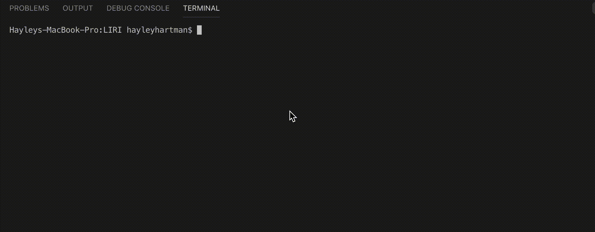
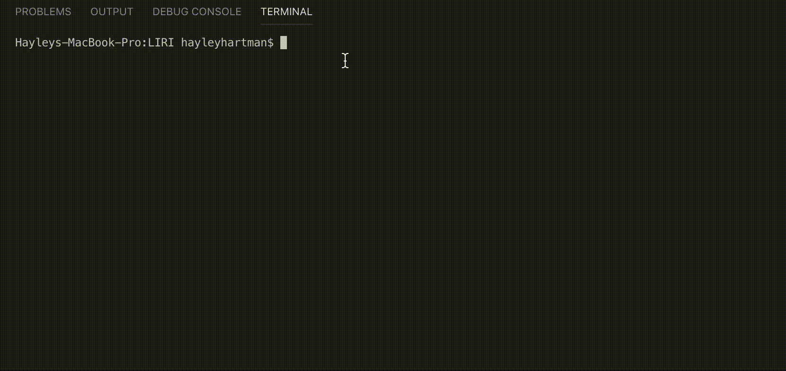

# LIRI

LIRI is an application made by me, Hayley Hartman, in October 2018. LIRI is a command line node app that returns information to the user based on the command entered. Users can use this app to search a specific movie, song, or musician, and the app returns information back through the console. 

In order to run this app, clone this repository to your own computer, and enter the directory through terminal or bash. On entry, run npm install on the command line. Once you've done that, start each command with node liri and then the liri command. 

Command | Source | Function
------- | ------ | -------- 
movie-this [+ a movie title] | OMDB API | returns movie information for a movie of the user's choice
concert-this [+ a band name] | bands in town API | returns the next five shows that band is playing, the name of the venue, and the date of the show
spotify-this-song [+ song title] | node spotify API | returns song information for a song of the user's choice
do-this | fs and any of the above APIs | retrieves information from a separate document (formatted as command,thing to be searched)

### movie-this example

### spotify-this-song example

